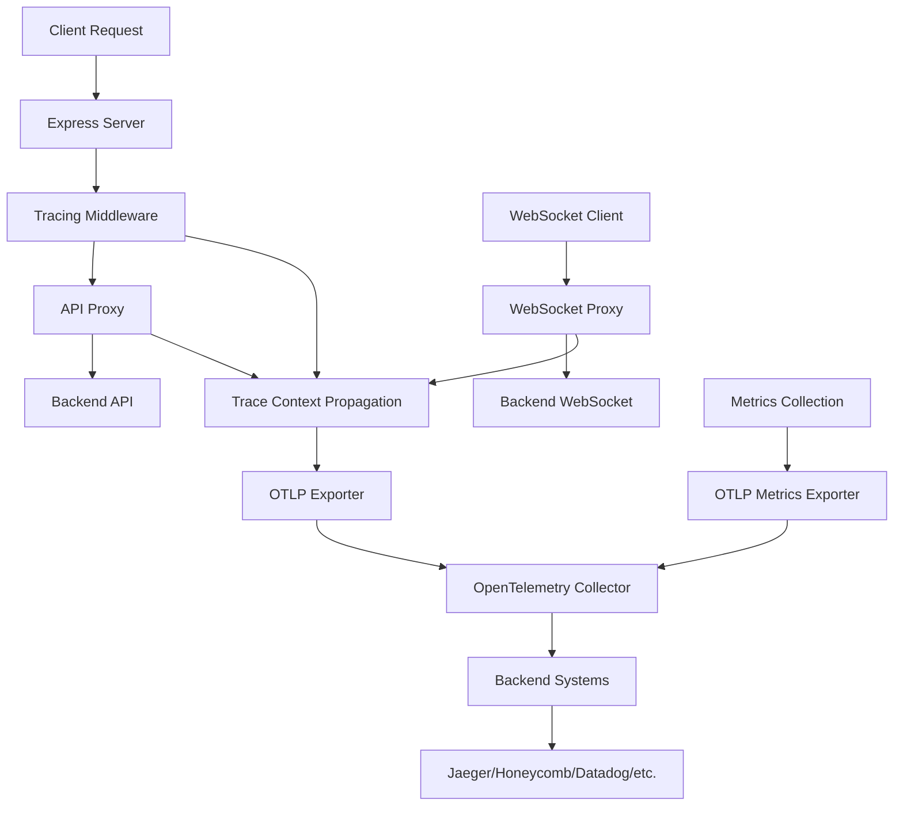

# OpenTelemetry Tracing and Metrics Implementation

This document describes the OpenTelemetry tracing and metrics implementation for the Zensor Portal UI server.

## Overview

The application implements comprehensive distributed tracing and metrics using OpenTelemetry to provide visibility into:
- HTTP API requests and responses
- WebSocket connections and message forwarding
- Backend API calls with context propagation
- Error tracking and performance monitoring
- Request traffic, error rates, and latency metrics

## Architecture



## Components

### 1. Tracing Configuration (`server/tracing.js`)

The main tracing and metrics configuration file that:
- Initializes the OpenTelemetry SDK
- Configures OTLP exporters for traces and metrics
- Sets up automatic instrumentation
- Provides utility functions for span creation, context propagation, and metrics recording

**Key Features:**
- Service name: `zensor-ui` (configurable via `OTEL_SERVICE_NAME`)
- Service version: `1.0.0` (configurable via `OTEL_SERVICE_VERSION`)
- B3 propagation format for trace context
- OTLP exporters for OpenTelemetry Collector integration
- Custom metrics with `zensor_ui_` prefix

### 2. Express Middleware (`server/middleware/tracing.js`)

Custom middleware that:
- Creates server spans for incoming HTTP requests
- Extracts trace context from incoming headers
- Tracks response times and status codes
- Handles error scenarios

**Span Attributes:**
- `span.kind`: "server"
- `component`: "zensor-ui"
- `http.method`: HTTP method
- `http.url`: Request URL
- `http.status_code`: Response status code
- `http.response_time_ms`: Response time in milliseconds
- `http.user_agent`: Client user agent
- `http.request_id`: Request ID (if present)
- `http.tenant_id`: Tenant ID (if present)
- `http.user_id`: User ID (if present)

### 3. API Proxy Tracing (`server/middleware/api-proxy.js`)

Enhanced API proxy with tracing that:
- Creates client spans for backend API calls
- Injects trace context into outgoing headers
- Tracks API response times and status codes
- Propagates trace context to backend services

**Span Attributes:**
- `span.kind`: "client"
- `component`: "zensor-ui"
- `operation`: "api_proxy"
- `http.method`: HTTP method
- `http.url`: Request URL
- `http.target_url`: Backend API URL
- `http.status_code`: Response status code
- `http.response_time_ms`: Response time in milliseconds
- `http.response_size`: Response content length
- `http.response_content_type`: Response content type

### 4. WebSocket Proxy Tracing (`server/middleware/websocket-proxy.js`)

WebSocket proxy with tracing that:
- Creates spans for WebSocket connections
- Tracks message forwarding between client and backend
- Monitors connection status and errors
- Records message sizes and directions

**Span Attributes:**
- `span.kind`: "server" (for connections), "client" (for message forwarding)
- `component`: "zensor-ui"
- `operation`: "websocket_connection" or "websocket_message_forward"
- `websocket.url`: WebSocket URL
- `websocket.protocol`: "ws"
- `websocket.direction`: "upstream_to_client" or "client_to_upstream"
- `websocket.message_size`: Message size in bytes
- `websocket.connection_status`: "connected", "closed", "error"
- `websocket.close_code`: WebSocket close code
- `websocket.close_reason`: WebSocket close reason

## Metrics Collection

The application collects comprehensive metrics with the `zensor_ui_` prefix to match your backend's `zensor_server_` prefix:

### HTTP Metrics

#### `zensor_ui_http_requests_total`
- **Type**: Counter
- **Description**: Total number of HTTP requests
- **Labels**:
  - `method`: HTTP method (GET, POST, PUT, DELETE, etc.)
  - `path`: Request path
  - `status_code`: HTTP status code
  - `component`: Always "zensor-ui"
  - `operation`: Operation type (api_proxy, etc.)
  - `tenant_id`: Tenant ID (if present)
  - `user_id`: User ID (if present)

#### `zensor_ui_http_request_duration_seconds`
- **Type**: Histogram
- **Description**: HTTP request duration in seconds
- **Labels**: Same as `zensor_ui_http_requests_total`
- **Buckets**: Default histogram buckets for latency analysis

#### `zensor_ui_http_errors_total`
- **Type**: Counter
- **Description**: Total number of HTTP errors (4xx and 5xx)
- **Labels**: Same as `zensor_ui_http_requests_total` plus:
  - `error_type`: "client_error" (4xx) or "server_error" (5xx)

### WebSocket Metrics

#### `zensor_ui_websocket_connections_total`
- **Type**: Counter
- **Description**: Total number of WebSocket connections
- **Labels**:
  - `component`: Always "zensor-ui"
  - `operation`: "websocket_connection"
  - `url`: WebSocket URL
  - `protocol`: "ws"
  - `user_agent`: Client user agent
  - `remote_addr`: Client IP address

#### `zensor_ui_websocket_messages_total`
- **Type**: Counter
- **Description**: Total number of WebSocket messages
- **Labels**:
  - `component`: Always "zensor-ui"
  - `operation`: "websocket_message_forward"
  - `direction`: "upstream_to_client" or "client_to_upstream"
  - `message_size`: Message size in bytes

#### `zensor_ui_websocket_errors_total`
- **Type**: Counter
- **Description**: Total number of WebSocket errors
- **Labels**:
  - `component`: Always "zensor-ui"
  - `operation`: "websocket_connection" or "websocket_message_forward"
  - `error_type`: "upstream_error", "client_error", or "send_error"
  - `error_message`: Error message (if available)

### Metrics Usage Examples

#### Prometheus Queries
```promql
# Request rate per second
rate(zensor_ui_http_requests_total[5m])

# Error rate percentage
rate(zensor_ui_http_errors_total[5m]) / rate(zensor_ui_http_requests_total[5m]) * 100

# 95th percentile latency
histogram_quantile(0.95, rate(zensor_ui_http_request_duration_seconds_bucket[5m]))

# WebSocket connection rate
rate(zensor_ui_websocket_connections_total[5m])

# WebSocket message rate by direction
rate(zensor_ui_websocket_messages_total[5m]) by (direction)
```

#### Grafana Dashboard Queries
```promql
# Request count by status code
sum(rate(zensor_ui_http_requests_total[5m])) by (status_code)

# Average response time
rate(zensor_ui_http_request_duration_seconds_sum[5m]) / rate(zensor_ui_http_request_duration_seconds_count[5m])

# Error rate by operation
rate(zensor_ui_http_errors_total[5m]) by (operation)
```

## Trace Context Propagation

The application uses B3 propagation format to propagate trace context to backend services:

### Headers Used
- `B3-Trace-Id`: 64-bit trace ID
- `B3-Span-Id`: 64-bit span ID
- `B3-Parent-Span-Id`: 64-bit parent span ID
- `B3-Sampled`: Sampling decision (0 or 1)

### Context Flow
1. **Incoming Request**: Extract trace context from headers
2. **Server Span**: Create server span for the request
3. **API Proxy**: Create client span for backend call
4. **Context Injection**: Inject trace context into backend request headers
5. **Backend Processing**: Backend receives and processes with trace context
6. **Response**: Backend response completes the trace

## Configuration

### Environment Variables

| Variable                      | Default                 | Description              |
| ----------------------------- | ----------------------- | ------------------------ |
| `OTEL_SERVICE_NAME`           | `zensor-ui`             | Service name for tracing |
| `OTEL_SERVICE_VERSION`        | `1.0.0`                 | Service version          |
| `OTEL_EXPORTER_TYPE`          | `otlp`                  | Exporter type (otlp)     |
| `OTEL_EXPORTER_OTLP_ENDPOINT` | `http://localhost:4318` | OTLP collector base URL  |

### Example Configuration

```bash
# OTLP configuration (default)
export OTEL_SERVICE_NAME="zensor-ui"
export OTEL_SERVICE_VERSION="1.0.0"
export OTEL_EXPORTER_TYPE="otlp"
export OTEL_EXPORTER_OTLP_ENDPOINT="http://otel-collector:4318"

# Alternative OTLP endpoints
export OTEL_EXPORTER_OTLP_ENDPOINT="http://localhost:4318"  # Local collector
export OTEL_EXPORTER_OTLP_ENDPOINT="https://api.honeycomb.io"  # Honeycomb
export OTEL_EXPORTER_OTLP_ENDPOINT="https://api.datadoghq.com/api/v2/otlp"  # Datadog

# Note: The application automatically appends:
# - /v1/traces for trace data
# - /v1/metrics for metrics data
```

## Usage

### OpenTelemetry Collector Setup

Before running the application, you need to set up an OpenTelemetry Collector:

#### Option 1: Docker Compose (Recommended)
```bash
# Start OpenTelemetry Collector with Jaeger
docker-compose -f docs/docker-compose.otel.yml up -d

# This will start:
# - OpenTelemetry Collector on ports 4317 (gRPC) and 4318 (HTTP)
# - Jaeger UI on http://localhost:16686
# - Optional: Prometheus on http://localhost:9090
# - Optional: Grafana on http://localhost:3000
```

#### Option 2: Manual Docker
```bash
# Run OpenTelemetry Collector
docker run -p 4317:4317 -p 4318:4318 \
  -v $(pwd)/docs/otel-collector-config.yaml:/etc/otelcol-contrib/otel-collector-config.yaml \
  otel/opentelemetry-collector-contrib:latest
```

#### Option 3: Direct to Backend
Configure your application to send traces and metrics directly to your preferred backend:
```bash
# Honeycomb
export OTEL_EXPORTER_OTLP_ENDPOINT="https://api.honeycomb.io"
export OTEL_EXPORTER_OTLP_HEADERS="x-honeycomb-team=your-api-key,x-honeycomb-dataset=zensor-ui"

# Datadog
export OTEL_EXPORTER_OTLP_ENDPOINT="https://api.datadoghq.com/api/v2/otlp"
export OTEL_EXPORTER_OTLP_HEADERS="DD-API-KEY=your-api-key"
```

### Starting the Server with Tracing

```bash
# Development with tracing
npm run dev:tracing

# Production with tracing
npm run start:tracing

# Test tracing and metrics functionality
npm run test:observability
```

### Viewing Traces and Metrics

1. **OpenTelemetry Collector**: Configure your collector to export to your preferred backend
2. **Jaeger**: If collector exports to Jaeger, navigate to `http://localhost:16686`
3. **Prometheus**: For metrics, navigate to `http://localhost:9090`
4. **Grafana**: For dashboards, navigate to `http://localhost:3000`
5. **Other backends**: Use your OTLP-compatible observability platform (Honeycomb, Datadog, etc.)

### Trace Examples

#### HTTP API Request
```
GET /api/tenants
├── Server Span: GET /api/tenants
│   ├── Client Span: API Proxy: GET /api/tenants
│   │   └── Backend: GET /v1/tenants
│   └── Response: 200 OK
```

#### WebSocket Connection
```
WebSocket Connection
├── Connection Span: WebSocket Connection
├── Message Span: WebSocket Message Forward (client_to_upstream)
├── Message Span: WebSocket Message Forward (upstream_to_client)
└── Close Span: WebSocket Connection (closed)
```

## Error Handling

The tracing implementation includes comprehensive error handling:

### Error Attributes
- `error`: true
- `error.message`: Error message
- `error.name`: Error name
- `error.stack`: Error stack trace

### Error Scenarios
- HTTP request failures
- WebSocket connection errors
- Backend API errors
- Network timeouts
- JSON parsing errors

## Performance Considerations

### Sampling
- Default sampling rate: 100% (all traces)
- Configurable via OpenTelemetry SDK settings
- Consider reducing sampling in production for high-traffic applications

### Span Limits
- Maximum attributes per span: 128 (OpenTelemetry default)
- Maximum events per span: 128 (OpenTelemetry default)
- Maximum links per span: 128 (OpenTelemetry default)

### Memory Usage
- Spans are exported asynchronously
- Memory usage scales with trace volume
- Consider implementing span batching for high-traffic scenarios

## Troubleshooting

### Common Issues

1. **Traces not appearing in backend**
   - Check OTLP endpoint configuration
   - Verify OpenTelemetry Collector is running
   - Check network connectivity to collector
   - Verify collector is configured to export to your backend

2. **Context propagation not working**
   - Verify B3 headers are being sent
   - Check backend service trace configuration
   - Ensure headers are not being stripped by proxies

3. **High memory usage**
   - Reduce sampling rate
   - Implement span batching
   - Check for span leaks (spans not being ended)

### Debug Mode

Enable debug logging by setting:
```bash
export NODE_ENV=development
```

This will log trace context headers and span creation details.

## Integration with Backend Services

### Backend Requirements

For complete trace visibility, backend services should:
1. Accept B3 trace context headers
2. Create server spans for incoming requests
3. Propagate context to downstream services
4. Export traces to the same collector

### Example Backend Integration

```javascript
// Backend service should extract trace context
const traceContext = propagation.extract(context.active(), req.headers);

// Create server span
const span = tracer.startSpan(`${req.method} ${req.path}`, {
  kind: SpanKind.SERVER,
  attributes: {
    'span.kind': 'server',
    'http.method': req.method,
    'http.url': req.url,
  }
}, traceContext);
```

## Future Enhancements

### Planned Features
- Custom metrics collection
- Log correlation with traces
- Performance monitoring dashboards
- Alerting based on trace data
- Custom span attributes for business logic

### Advanced Configuration
- Dynamic sampling based on request patterns
- Custom span processors
- Trace filtering and routing
- Multi-tenant trace isolation
